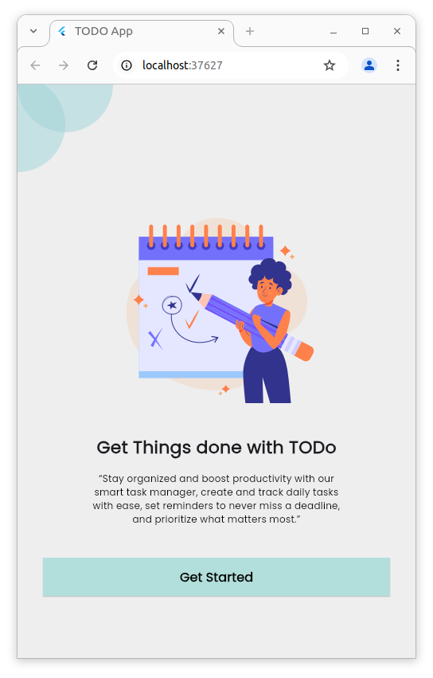
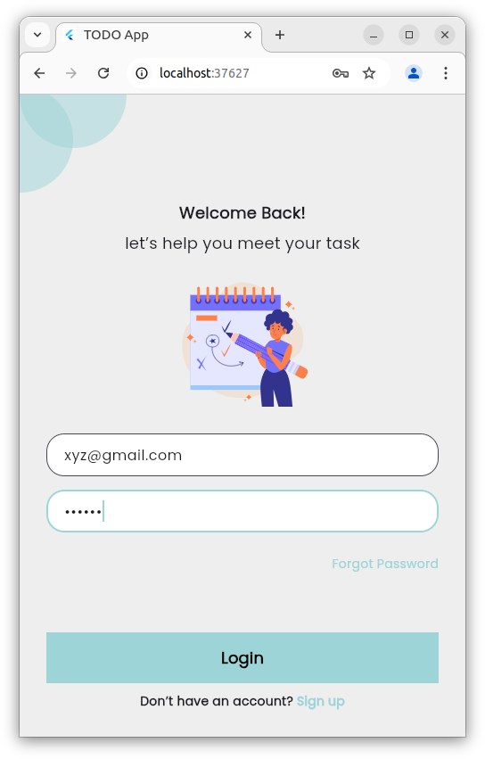
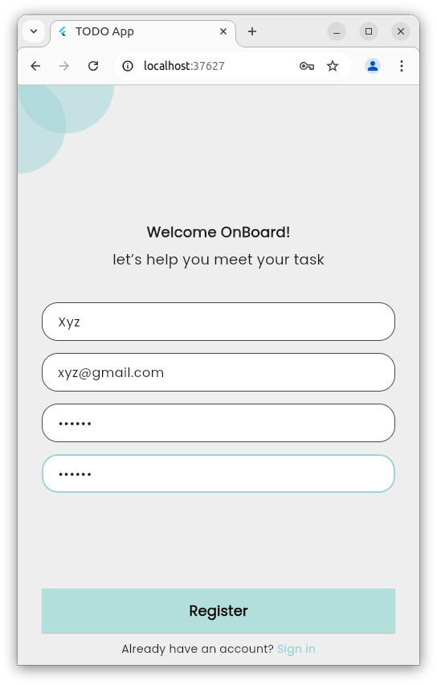
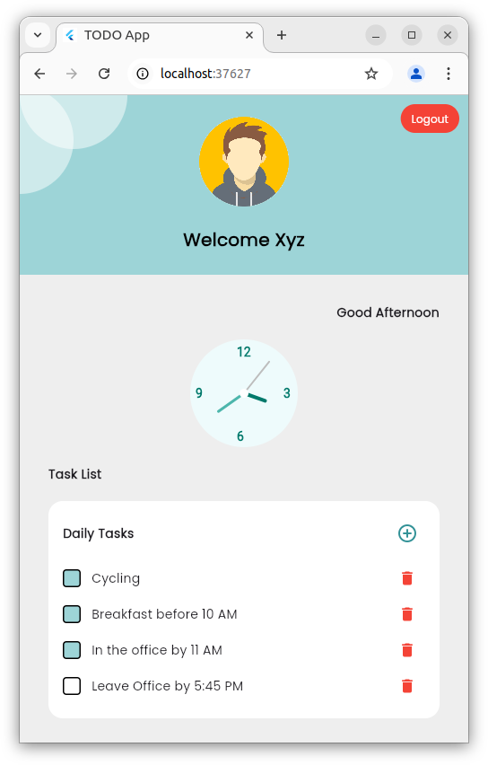

# 📝 ToDo App — Flutter Productivity App

Welcome to the **ToDo App**, a beautifully designed task management tool built with **Flutter**, offering a clean interface, responsive layout, and persistent data storage using secure and shared preferences.

<p align="center">
  
</p>

---

## 🚀 Features

| Feature                          | Description                                                                 |
|----------------------------------|-----------------------------------------------------------------------------|
| 🧭 Onboarding                    | Smooth introduction screen to guide first-time users                        |
| 🔐 Authentication                | Registration & Login using local storage and Flutter Secure Storage         |
| 👤 Personalized Dashboard        | Welcomes users with profile and greeting based on time                      |
| ✅ Task Management               | Add, view, and delete tasks with persistent storage                         |
| 🎨 Clean UI/UX                   | UI design mimics modern minimalistic productivity apps                      |
| 💾 Secure Storage                | `flutter_secure_storage` keeps user-specific data private                   |
| 🗂️ Persistent Data               | `shared_preferences` ensures task data stays after app closes or reloads    |

---

## 📱 Screenshots

<p align="center">
  
  
  
  
</p>

---

## 📦 Dependencies

| Package                  | Version  | Purpose                              |
|--------------------------|----------|--------------------------------------|
| `flutter_svg`            | ^2.0.7   | Renders SVG assets                   |
| `shared_preferences`     | ^2.2.2   | Local data storage for tasks         |
| `flutter_secure_storage` | ^9.0.0   | Secure storage for user credentials  |
| `cupertino_icons`        | ^1.0.8   | iOS-style icons                      |
| `flutter_lints`          | ^5.0.0   | Code linting and best practices      |

---

## 📁 Folder Structure

```
lib/
├── main.dart
├── screens/
│   ├── onboarding.dart
│   ├── login.dart
│   ├── register.dart
│   └── dashboard.dart
├── widgets/
│   ├── task_tile.dart
│   └── task_storage_service.dart
└── models/
```

---

## 💡 Architecture & Design Highlights

- **State Management**: Uses `StatefulWidget` for local UI state control.
- **Storage Service**: Encapsulated storage logic in `task_storage_service.dart` for modularity.
- **UI Separation**: Widgets like `TaskTile` ensure reusability and clean code structure.
- **Persistent Storage**: Tasks and user data are loaded and stored using async operations to ensure smooth UX.

---

## 🔧 Setup Instructions

1. Clone the repo:
   ```bash
   git clone https://github.com/your-username/todoapp.git
   cd todoapp
   ```

2. Install dependencies:
   ```bash
   flutter pub get
   ```

3. Run the app:
   ```bash
   flutter run
   ```

---

## 🔐 User Data Handling

- User login and registration details are securely stored via `flutter_secure_storage`.
- Tasks are synced using `shared_preferences`, ensuring persistence through hot reloads or app refreshes.
- Each user has isolated task data once authenticated.

---

## 🧑‍🎨 Fonts & Assets

| Type     | Path                        |
|----------|-----------------------------|
| Font     | `assets/fonts/Poppins-Regular.ttf` |
| Images   | `assets/illustation.png`, `assets/profile.png` |
| SVGs     | `assets/onboarding.svg`     |

---

## 🛠️ Tech Stack

- **Flutter SDK**: ^3.7.2
- **Language**: Dart
- **Architecture**: Stateful + Service-based Storage
- **Design Reference**: Based on modern task apps with a personal dashboard look

---

## 📌 To-Do Future Scope

- [ ] Add date & time picker to schedule tasks
- [ ] Filter tasks (e.g., by date or priority)
- [ ] Implement dark mode support

---

## 🛡️ CI/CD & Deployment

### ✅ GitHub Actions

This project uses a simple GitHub Actions CI setup to validate build integrity:

```yaml
name: Flutter CI

on:
  push:
    branches: [main]
  pull_request:
    branches: [main]

jobs:
  build:
    runs-on: ubuntu-latest
    steps:
    - uses: actions/checkout@v3
    - name: Install Flutter
      uses: subosito/flutter-action@v2
      with:
        flutter-version: '3.7.2'
    - name: Install dependencies
      run: flutter pub get
    - name: Run Analyzer
      run: flutter analyze
    - name: Run Tests
      run: flutter test
```

---

### 🚀 Deployment Notes

- App is intended for local/emulator use during development.
- To deploy to Android/iOS:
  - Configure `android/app/build.gradle` and `ios/Runner/Info.plist`.
  - Build the release version using:
    ```bash
    flutter build apk --release
    flutter build ios --release
    ```

---

## 📄 License

This project is for educational purposes and not licensed for redistribution without author permission.

---


---

Made with ❤️ using Flutter